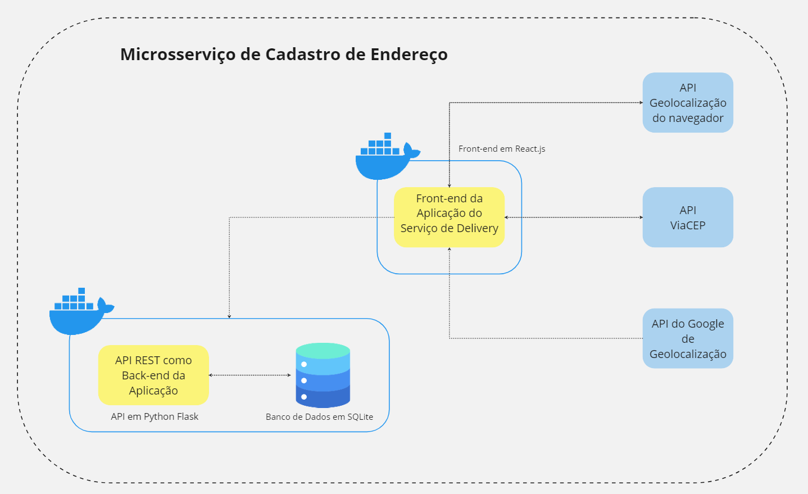
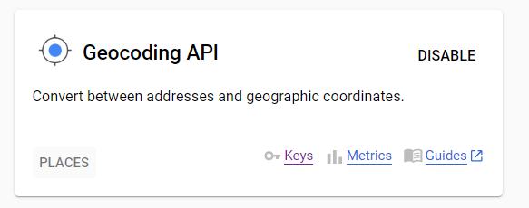
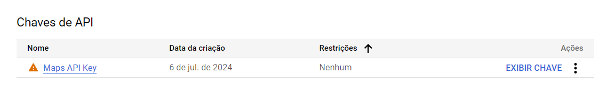

# Microsserviço de Endereços.

Este projeto faz parte da Sprint de **Arquitetura de Software** da Pós Graduação da PUC-RIO.
O principal objetivo é fornecer um microsserviço para cadastro de endereço de clientes de um serviço de delivery. Este endereço é
checado em relação ao endereço da requisição, para se ter certeza de que o delivery está sendo entregue para o local correto.

# Fluxograma da Aplicação



# Organização do Projeto

Este projeto está organizado de acordo com as seguintes estruturas de pastas e arquivos:

## Pastas

- **src:**

  - (abreviação de "source") é a pasta principal onde está localizado o código-fonte da aplicação.

    - **api**
      - Pasta contendo os dados das APIs que se relacionam com a aplicação.
    - **components**
      - Pasta com os componentes utilizados na confecção da aplicação.

## Arquivos fora de pastas

- **App.js:**

  - O App.js é o componente raiz da aplicação React. Ele é o ponto onde você define a estrutura geral da aplicação e onde são incorporados os componentes.

Este projeto foi iniciado com o [Create React App](https://github.com/facebook/create-react-app).

## Scripts Disponíveis

No diretório raiz do projeto, você pode executar:

### `npm install`

Instala as dependências listadas no `package.json` para o seu projeto.

### `npm start`

Executa o aplicativo no modo de desenvolvimento.\
Abra [http://localhost:3000](http://localhost:3000) para visualizá-lo no seu navegador.

A página será recarregada quando você fizer alterações.\
Você também pode ver quaisquer erros de lint no console.

### `npm test`

Inicia o runner de testes no modo interativo de observação.\
Veja a seção sobre [executando testes](https://facebook.github.io/create-react-app/docs/running-tests) para mais informações.

### `npm run build`

Cria uma versão de produção do aplicativo na pasta `build`.\
Ele agrupa o React corretamente no modo de produção e otimiza a build para o melhor desempenho.

A build é minificada e os nomes dos arquivos incluem hashes.\
Seu aplicativo está pronto para ser implantado!

Veja a seção sobre [implantação](https://facebook.github.io/create-react-app/docs/deployment) para mais informações.

### `npm run eject`

**Nota: esta é uma operação irreversível. Uma vez que você `eject`, não é possível voltar atrás!**

Se você não estiver satisfeito com as ferramentas de build e as escolhas de configuração, você pode `eject` a qualquer momento. Este comando removerá a única dependência de build do seu projeto.

Em vez disso, ele copiará todos os arquivos de configuração e as dependências transitivas (webpack, Babel, ESLint, etc.) diretamente para o seu projeto, para que você tenha controle total sobre eles. Todos os comandos, exceto `eject`, ainda funcionarão, mas eles apontarão para os scripts copiados para que você possa ajustá-los. A partir deste ponto, você está por conta própria.

Você não precisa usar `eject` se não quiser. O conjunto de recursos curados é adequado para implantações pequenas e médias, e você não deve se sentir obrigado a usar esse recurso. No entanto, entendemos que essa ferramenta não seria útil se você não pudesse personalizá-la quando estiver pronto para isso.

## Docker

### Requisitos

Certifique-se de ter o Docker e o Docker Compose instalados em sua máquina. Você pode seguir as instruções de instalação no [site oficial do Docker](https://docs.docker.com/get-docker/) e [Docker Compose](https://docs.docker.com/compose/install/).

### Usando Docker Compose

Após clonar o repositório, vá até o diretório raiz do projeto e execute o seguinte comando para iniciar os serviços definidos no `docker-compose.yml`:

```
docker-compose up --build
```

# APIs

A Aplicação comunica-se com 4 principais APIs. São elas:

- **API de Geolocalização do Navegador:** API embutida no navegador, responsável por retornar os dados de latitude e longitude do usuários.
- **API ViaCEP:** API externa utilizada para buscar informações de endereço com base no CEP.
- **API de de Localização do Google Maps:** API externa para buscar os dados do CEP baseado na latitude e longitude fornecida.
- **API do Back-end da Aplicação:** API que armazena os dados dos usuários em relação ao endereço.

## Configuração das APIs Externas

### API ViaCEP

API ViaCEP é uma API que retorna os dados de um CEP específico do Brasil. No microsserviço em questão, ela é utilizada para o
preenchimento dos dados como Rua, Cidade e Estado. Para seu uso, não é necessária uma licença de uso nem cadastro. A rota utilizada na API é a seguinte:

- **GET: viacep.com.br/ws/CEP/json/**, sendo a variável CEP sendo o valor numérico do CEP em questão.

### API de Geolocalização do Navegador

Essa API utilizada é embutida no Navegador. Portanto, não faz uso direto de nenhuma rota. Não é necessário cadastro nem licença de uso.
Sua utilização é feita a partir da função:

```
navigator.geolocation.getCurrentPosition()
```

### API de de Localização do Google Maps

API do Google de Geolocalização. Para seu uso, será necessário Cadastro e Licença de uso.
Para o Acesso gratuito da API, siga os seguintes passos:

1.  **Para criação de uma conta gratuita e início do período de teste, basta seguir esses passos:** https://medium.com/@prayag-sangode/create-a-google-cloud-free-trial-account-7075fb70b8bc . É possível receber 90 dias de uso gratuito dos seus serviços e USD 300 dólares
    créditos nesse período. É importante destacar que** nenhuma cobrança será realiada a não ser que o usuário ativamente selecione para migrar para o plano pago**.

2.  Após configurar sua conta do Google Cloud, **acesse a página de APIs:** https://console.cloud.google.com/google/maps-apis/api-list?project=xenon-machine-423718-v8&hl=pt-BR

3.  Em Geocoding API, **selecione KEYS**

    ~ç==

4.  **Configure sua Chave da API.**

    

As Rotas utilizadas na API de Localização do Google foram as seguintes:

```
https://maps.googleapis.com/maps/api/geocode/json?latlng=LATITUDE,LONGITUDE&key=SUACHAVEAPI
```

Para o uso da API do Google na aplicação, crie um arquivo .env na raiz do diretório e adicione sua chave, com o nome de REACT_APP_GOOGLEMAPSAPIKEY.

Para mais informações sobre a API de geolocalização, acesse: https://developers.google.com/maps/documentation/geocoding
